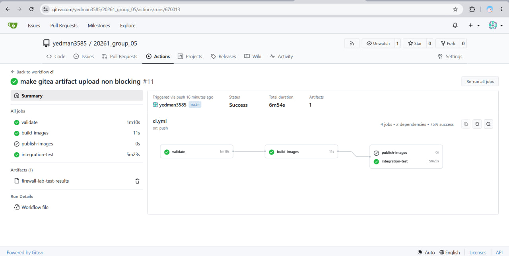
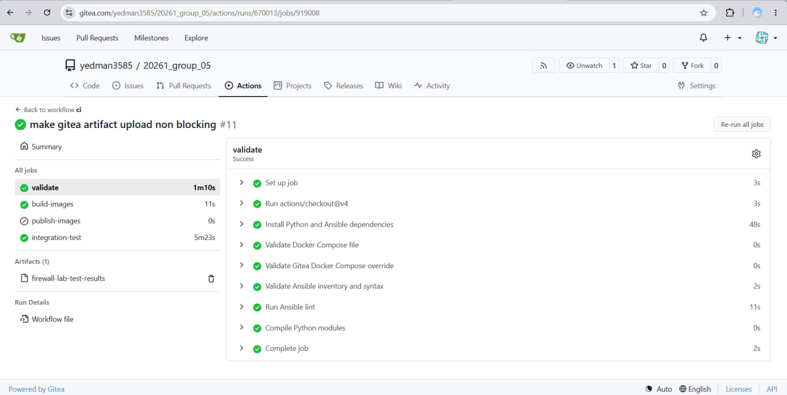
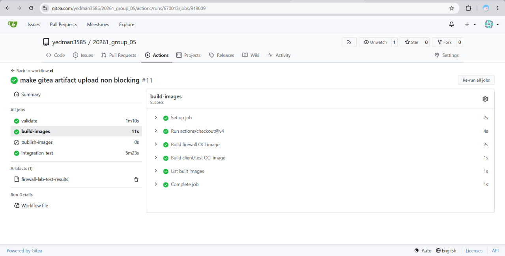
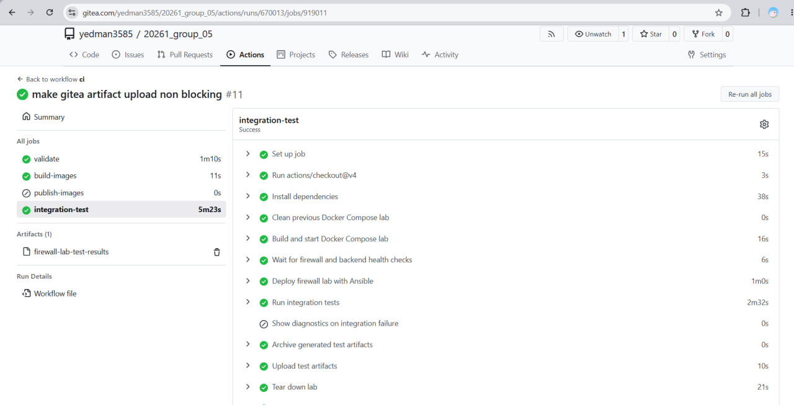

# Scalable High-Availability Firewall Cluster - Group 05

This project implements a high-availability firewall lab with Docker Compose,
Ansible, nftables, Keepalived/VRRP, conntrackd, automated tests, monitoring,
and a Gitea Actions workflow.

The main purpose of the project is to show that a firewall cluster can be
provisioned repeatably from code, not configured manually inside containers.
The important evidence is therefore not only that containers start, but that
Ansible renders and applies real firewall rules, Keepalived owns and moves the
VIPs, conntrackd runs, routes force client/server traffic through the firewall,
and automated tests prove allowed traffic passes while blocked traffic fails.

Latest verification evidence in this repository copy:

- Local WSL/Docker verification: 2026-07-06
- Docker Compose stack: started successfully
- Ansible deployment: passed with `failed=0`
- Full integration test playbook: passed
- Test result: 85 passed, 0 failed, 11 skipped
- VIP availability during the automated failover stress run: 65.5%
- Recorded failover events during the failover tests: 11
- Health monitor note: one transient split-brain snapshot was recorded during the forced failover/double-failure stress path; pytest assertions still passed and final VIP ownership returned to fw1
- Gitea Actions verification: green run with validate, build-images, and integration-test jobs
- Final Debian 13 amd64 verification: 2026-07-10 on an Azure VM running `Debian GNU/Linux 13.5` on `x86_64`
- Docker on the Debian verification host: Docker Engine `29.6.1`, Docker Compose `v5.3.1`
- Repository cloned from Gitea on the Debian verification host at commit `e10265d`
- Debian verification result: Docker Compose start, Ansible deployment, nftables inspection, and `ansible/playbooks/run_tests.yml` all passed with `pytest exit: 0`

Generated local report after tests:

```text
test_results/report.html
test_results/summary.json
test_results/pytest.stdout.log
test_results/pytest.stderr.log
```

---

## Table Of Contents

1. [Installation](#1-installation)
2. [Git Repository History](#2-git-repository-history)
3. [Testing And Verification](#3-testing-and-verification)
4. [Infrastructure And Gitea](#4-infrastructure-and-gitea)
5. [Environments](#5-environments)
6. [Work Distribution And Team Contributions](#6-work-distribution-and-team-contributions)
7. [Ansible Deployment](#7-ansible-deployment)
8. [Important Ansible Files](#8-important-ansible-files)
9. [Firewall Rules And nftables Evidence](#9-firewall-rules-and-nftables-evidence)
10. [Improvements After Review](#10-improvements-after-review)
11. [AI Usage Documentation And References](#11-ai-usage-documentation-and-references)
12. [Troubleshooting](#12-troubleshooting)

---

## 1. Installation

The installation requirement is covered by a complete Docker Compose and Ansible
startup path for Debian 13 amd64 and compatible WSL2/Linux amd64 environments.
The project does not only list dependencies; it also gives the exact commands to
create the Python environment, install Ansible dependencies, start the lab,
deploy the firewall configuration, and run the verification playbook.

These commands are intended for Debian 13 amd64 or WSL2 with Docker Desktop
integration enabled. Run all commands from the repository root, the directory
that contains `docker-compose.yml`.

### 1.1 Required environment before running

Before starting the lab, make sure the following conditions are true:

- The host is Debian 13 amd64, another compatible Linux amd64 system, or WSL2 on Windows.
- Docker is installed from Docker's official packages or Docker Desktop.
- The Docker daemon is running.
- Docker Compose v2 is available as `docker compose`.
- On Windows/WSL2, Docker Desktop WSL integration is enabled for the distro used to run commands.
- The terminal is inside the project root where `docker-compose.yml` is located.
- The Python virtual environment is created and activated before running Ansible commands.
- Python dependencies from `requirements.txt` are installed inside that virtual environment.
- Ansible collections from `ansible/requirements.yml` are installed.
- The Docker user can start privileged containers and create custom Docker networks.
- Enough memory is available for eight lab containers plus Docker Desktop or WSL overhead.

Useful pre-check commands:

```bash
pwd
test -f docker-compose.yml
docker --version
docker compose version
docker info >/dev/null
python3 --version
```

After the virtual environment and Ansible dependencies are installed, these
commands should also work:

```bash
python -m pytest --version
ansible --version
ansible-galaxy collection list community.docker
```

If any command fails, fix the local environment first. The project deployment
expects these tools to be available before Docker Compose and Ansible are run.

### 1.2 Install dependencies on the control host

```bash
sudo apt-get update
sudo apt-get install -y python3 python3-venv python3-pip git curl
```

Docker must be installed from Docker's official repository, not only from old
Debian packages. Verify:

```bash
docker --version
docker compose version
```

### 1.3 Clone and enter the project

```bash
git clone <repository-url> 20261_group_05
cd 20261_group_05
```

### 1.4 Create the Python/Ansible environment

```bash
python3 -m venv .venv_linux
source .venv_linux/bin/activate
python -m pip install --upgrade pip
python -m pip install -r requirements.txt
ansible-galaxy collection install -r ansible/requirements.yml
```

### 1.5 Run static checks

```bash
bash run_wsl_checks.sh
```

This runs:

- `ansible-inventory --graph`
- `ansible-playbook ansible/playbooks/site.yml --syntax-check`
- `ansible-lint ansible/`

Latest observed static-check output from 2026-07-06:

```text
Using Python: .venv_linux/bin/python
Using Ansible inventory: .venv_linux/bin/ansible-inventory
=== Running Inventory Graph ===
@all:
  |--@firewalls:
  |  |--@firewall_cluster_main:
  |  |  |--fw1
  |  |  |--fw2
  |  |  |--fw3
  |--@backend_servers:
  |  |--server1
  |  |--server2
  |--@test_clients:
  |  |--client1
  |  |--client2
  |  |--client3
=== Running Syntax Check ===
playbook: ansible/playbooks/site.yml
=== Running Ansible Lint ===
Passed: 0 failure(s), 0 warning(s) in 43 files processed of 46 encountered.
Profile 'production' was required, and it passed.
```

### 1.6 Start the lab

```bash
docker compose up -d --build
docker compose ps
```

Wait until the firewall and backend containers are healthy:

```text
fw1      Up ... (healthy)
fw2      Up ... (healthy)
fw3      Up ... (healthy)
server1  Up ... (healthy)
server2  Up ... (healthy)
```

### 1.7 Deploy with Ansible

```bash
ANSIBLE_CONFIG=ansible/ansible.cfg \
  ansible-playbook ansible/playbooks/site.yml \
  -i ansible/inventory/hosts.yml
```

A successful deployment ends with `failed=0` for all hosts.

Latest observed Ansible deployment evidence from 2026-07-06:

```text
TASK [Validate firewall inventory and rule references]
ok: [fw1 -> localhost]

TASK [common : Fail fast if any required interface could not be detected]
ok: [fw1] => {"msg": "All assertions passed"}
ok: [fw2] => {"msg": "All assertions passed"}
ok: [fw3] => {"msg": "All assertions passed"}

TASK [firewall : Render nftables ruleset]
ok: [fw1]
ok: [fw2]
ok: [fw3]

TASK [firewall : Validate and apply nftables ruleset]
ok: [fw1]
ok: [fw2]
ok: [fw3]

TASK [keepalived : Render keepalived VRRP configuration]
ok: [fw1]
ok: [fw2]
ok: [fw3]

TASK [keepalived : Check keepalived status under supervisor]
ok: [fw1]
ok: [fw2]
ok: [fw3]

TASK [conntrackd : Render conntrackd synchronization configuration]
ok: [fw1]
ok: [fw2]
ok: [fw3]

TASK [conntrackd : Verify conntrackd control socket responds]
ok: [fw1]
ok: [fw2]
ok: [fw3]

TASK [routing : Add route to backend network via the frontend VIP on test clients]
changed: [client1]
changed: [client2]
changed: [client3]

TASK [routing : Add route to frontend network via the backend VIP on backend servers]
changed: [server1]
changed: [server2]

PLAY RECAP
client1 : ok=2  changed=1  unreachable=0  failed=0
client2 : ok=2  changed=1  unreachable=0  failed=0
client3 : ok=2  changed=1  unreachable=0  failed=0
fw1     : ok=16 changed=0  unreachable=0  failed=0
fw2     : ok=15 changed=0  unreachable=0  failed=0
fw3     : ok=15 changed=0  unreachable=0  failed=0
server1 : ok=2  changed=1  unreachable=0  failed=0
server2 : ok=2  changed=1  unreachable=0  failed=0
```

### 1.8 Run integration tests

```bash
ANSIBLE_CONFIG=ansible/ansible.cfg \
  ansible-playbook ansible/playbooks/run_tests.yml \
  -i ansible/inventory/hosts.yml
```

Expected final play recap:

```text
localhost : failed=0
```

Expected pytest summary from the latest local run:

```text
85 passed, 11 skipped
```

Latest observed test-playbook result from 2026-07-06:

```text
TASK [Verify test Python environment has pytest]
ok: [localhost]

TASK [Wait for firewall containers to become healthy]
ok: [localhost] => (item=fw1)
ok: [localhost] => (item=fw2)
ok: [localhost] => (item=fw3)

TASK [Run pytest integration suite]
ok: [localhost]

TASK [Generate HTML report]
ok: [localhost]

TASK [Show report location]
Report: test_results/report.html | pytest exit: 0
stdout: test_results/pytest.stdout.log
stderr: test_results/pytest.stderr.log

PLAY RECAP
localhost : ok=11 changed=0 unreachable=0 failed=0 skipped=2

pytest summary:
85 passed, 11 skipped in 168.52s
```

### 1.9 Debian 13 amd64 installation proof

The installation path above was also verified on the announced target-style
environment: a clean Azure VM running Debian 13 amd64 (`Debian GNU/Linux 13.5`,
`x86_64`) with Docker installed from docker.com. The same repository was cloned,
Docker Compose was started, Ansible deployed the firewall lab, nftables and
Keepalived were inspected, and the full test playbook passed with `pytest exit: 0`.

Proof artifacts:

- Debian 13 Azure proof document with screenshots and explanations: [docs/evidence/debian13-azure-proof.docx](docs/evidence/debian13-azure-proof.docx)
- Raw terminal transcript from the Debian 13 verification: [docs/evidence/debian13-terminal-proof.txt](docs/evidence/debian13-terminal-proof.txt)
- Verified Gitea Actions run: [https://gitea.com/yedman3585/20261_group_05/actions/runs/670013](https://gitea.com/yedman3585/20261_group_05/actions/runs/670013)

---

## 2. Git Repository History

The Git repository history should show regular, meaningful commits from the team.
The actual chronological proof remains in GitLab commit history. This README
adds context for that history by explaining how the individual parts were built,
connected, corrected after consultations, and finally verified.

The work distribution is kept as a separate section because the final project was
not only a set of individual files. Several important tasks were integration
work: connecting Docker Compose, Ansible, firewall rules, monitoring, automated
tests, Gitea Actions, and the final Debian 13 installation proof.

The GitLab branches also document the development process:

| Branch | Purpose |
| --- | --- |
| `main` | Final delivery branch. It contains the cleaned, tested project version, final README, Gitea evidence, and Debian 13 proof artifacts. |
| `oldmain` | Earlier complete project version before the final review-driven cleanup and proof updates. This branch is useful for comparing the first integrated version with the final delivery. |
| `iliyas-nftables` | Personal/team branch for Member 1 firewall and nftables-related work. |
| `said-testing` | Personal/team branch for Member 2 Docker/test environment work. |
| `ci/cd-setup` | CI/CD setup branch used for workflow and delivery automation work. |
| `monitoring-aisana` | Personal/team branch for Member 4 monitoring, dashboard, metrics, and logging work. |
| `yedige-ansible` | Personal/team branch for Member 5 Ansible orchestration and integration work. |
| `shahzod-final` | Shahzod's final integration/polishing branch before the final delivery was consolidated on `main`. |

---

## 3. Testing And Verification

Testing is documented as both automated and manual verification. The automated
path uses pytest and is orchestrated by Ansible, while the manual path lists the
commands that make the firewall behavior visible during review. This section also
contains report and monitoring checks because those files are part of the proof
that the lab behaves correctly after deployment.

### 3.1 Fast review path

The fastest meaningful review is this sequence:

1. Start Docker Compose.
2. Run the Ansible deployment.
3. Inspect the real nftables rules inside `fw1`.
4. Verify VIP ownership.
5. Run the integration test playbook.
6. Open `test_results/report.html`.

The most important check is:

```bash
docker exec fw1 nft list ruleset
```

This shows the firewall rules that are actually loaded in the Linux kernel.
It is stronger evidence than reading a template file, because it proves that
Ansible rendered and applied the rules successfully.

In an early version of the project this command showed only almost-empty
chains with `policy accept`. That meant the containers existed, but the
firewall was effectively not filtering traffic. The current version must show
real sets, real accept/drop rules, and default-drop policies.

Expected signs in the current output:

```text
table inet filter
chain input ... policy drop
chain forward ... policy drop
set admin_net_ipv4
set frontend_net_ipv4
set backend_servers_ipv4
ct state established,related accept
meta l4proto vrrp ... accept
udp dport 3780 ... accept
tcp dport { 80, 443 } ... accept
log prefix "DROP-IN " ... drop
log prefix "DROP-FWD " ... drop

table ip nat
chain postrouting
masquerade
```

Why this matters:

- `policy drop` proves the firewall is not default-allow.
- named sets prove the rules are generated from inventory/group vars.
- VRRP rules prove Keepalived traffic is allowed on the required networks.
- UDP 3780 proves conntrackd synchronization traffic is allowed.
- frontend-to-backend HTTP rules prove only selected application traffic is allowed.
- drop logging proves blocked traffic is observable.
- NAT table proves extra routing behavior is present and applied.

Latest observed nftables excerpt from 2026-07-06:

```text
table inet filter {
  set ssh_bruteforce { type ipv4_addr; flags dynamic,timeout; timeout 5m }
  set admin_net_ipv4 { elements = { 172.20.0.0/24 } }
  set admin_net_ipv6 { elements = { fd00:20::/64 } }
  set firewall_peer_net_ipv4 { elements = { 172.20.0.0/24 } }
  set frontend_net_ipv4 { elements = { 172.21.0.0/24 } }
  set backend_net_ipv4 { elements = { 172.22.0.0/24 } }
  set backend_servers_ipv4 { elements = { 172.22.0.31, 172.22.0.32 } }
  set backend_servers_ipv6 { elements = { fd00:22::31, fd00:22::32 } }

  chain input {
    type filter hook input priority filter; policy drop;
    ct state established,related accept
    iif "lo" accept
    tcp dport 22 ct state new add @ssh_bruteforce { ip saddr limit rate over 4/minute burst 5 packets } drop
    ip saddr @admin_net_ipv4 tcp dport 22 counter packets 0 bytes 0 accept
    ip saddr @firewall_peer_net_ipv4 meta l4proto vrrp counter packets 2 bytes 80 accept
    ip saddr @frontend_net_ipv4 meta l4proto vrrp counter packets 2 bytes 80 accept
    ip saddr @backend_net_ipv4 meta l4proto vrrp counter packets 2 bytes 80 accept
    ip saddr @firewall_peer_net_ipv4 udp dport 3780 counter packets 25285 bytes 910260 accept
    ip6 saddr @admin_net_ipv6 ip6 nexthdr ipv6-icmp counter packets 0 bytes 0 accept
    log prefix "DROP-IN " group 1 counter packets 22 bytes 1232 drop
  }

  chain forward {
    type filter hook forward priority filter; policy drop;
    ct state established,related accept
    ip saddr @frontend_net_ipv4 ip daddr @backend_servers_ipv4 tcp dport { 80, 443 } counter packets 1 bytes 60 accept
    ip6 saddr @frontend_net_ipv6 ip6 daddr @backend_servers_ipv6 tcp dport { 80, 443 } counter packets 0 bytes 0 accept
    ip saddr @frontend_net_ipv4 ip daddr @backend_net_ipv4 ip protocol icmp counter packets 0 bytes 0 accept
    log prefix "DROP-FWD " group 1 counter packets 3 bytes 180 drop
  }
}

table ip nat {
  chain postrouting {
    type nat hook postrouting priority srcnat; policy accept;
    ip saddr 172.22.0.0/24 oif "eth0" masquerade
  }
}
```

### Acceptance Criteria

The project can be considered complete when the following conditions are true:

- Ansible deploys all firewall nodes successfully with `failed=0`.
- All three firewall nodes are configured from the same inventory structure.
- nftables rules are generated from Ansible variables for both IPv4 and IPv6.
- `nft -c -f` validates the rendered firewall ruleset before it is applied.
- Keepalived failover moves the cluster IP automatically between firewall nodes.
- conntrackd synchronizes connection state between firewall nodes.
- Docker Compose provides separate and realistic management, frontend, and backend networks.
- Docker Compose provides test clients and backend servers so traffic can be tested through the firewall.
- Automated traffic tests prove that allowed flows pass and blocked flows fail.
- Monitoring and logging show firewall activity and failover events when the optional dashboard path is demonstrated.
- CI/CD validation runs where a compatible GitLab or Gitea runner with Docker access is available.
- Documentation lists the main requirements, implementation files, and validation results.

### 3.2 Automated test details

The project uses pytest. The most complete command is the Ansible test
playbook:

```bash
ANSIBLE_CONFIG=ansible/ansible.cfg \
  ansible-playbook ansible/playbooks/run_tests.yml \
  -i ansible/inventory/hosts.yml
```

It performs:

- test results directory creation
- pytest environment check
- firewall container health wait
- health monitor start
- pytest integration suite
- stdout/stderr log saving
- HTML report generation
- failure if pytest returns non-zero

Test files:

| Test file | What it proves |
| --- | --- |
| `tests/test_nftables_rules.py` | ruleset exists, default drop, dual-stack rules, ICMPv6, drop logging |
| `tests/test_failover.py` | initial master, VIP failover to fw2, preemption back to fw1, double failure to fw3 |
| `tests/test_conntrackd.py` | conntrackd process, socket, config, sync traffic, backup state |
| `tests/test_ipv6.py` | IPv6 forwarding and IPv6 rules; live connectivity skips if host lacks Docker IPv6 |
| `tests/test_port_isolation.py` | backend port 8080 is open locally but blocked through firewall |
| `tests/traffic_generator.py` | manual Scapy packet tool, skipped in normal automated pytest |

Latest local result:

```text
85 passed, 0 failed, 11 skipped
```

`11 skipped` is expected because some IPv6/scapy tests require host-level
network capabilities that are not always enabled in Docker Desktop or WSL.
The rules themselves are still checked.

### 3.3 Manual verification commands

These are the commands we expect the instructor or a teammate to run during a
manual review.

#### 3.3.1 Container health

```bash
docker compose ps
```

Expected:

```text
fw1      healthy
fw2      healthy
fw3      healthy
server1  healthy
server2  healthy
client1  up
client2  up
client3  up
```

Latest observed Docker Compose status from 2026-07-06:

```text
NAME      SERVICE   STATUS                    PORTS
client1   client1   Up 17 hours
client2   client2   Up 17 hours
client3   client3   Up 17 hours
fw1       fw1       Up 17 hours (healthy)     22/tcp, 80/tcp, 443/tcp, 5000/tcp
fw2       fw2       Up 17 hours (healthy)     22/tcp, 80/tcp, 443/tcp, 5001/tcp
fw3       fw3       Up 17 hours (healthy)     22/tcp, 80/tcp, 443/tcp, 5002/tcp
server1   server1   Up 17 hours (healthy)     80/tcp
server2   server2   Up 17 hours (healthy)     80/tcp
```

#### 3.3.2 VIP ownership

```bash
for vip in 172.20.0.100 172.21.0.100 172.22.0.100; do
  echo "VIP $vip"
  for fw in fw1 fw2 fw3; do
    docker exec $fw ip -4 addr show | grep -q "$vip" && echo "  owner: $fw"
  done
done
```

Expected after normal deployment: all three VIPs are owned by `fw1`.

Latest observed VIP ownership from 2026-07-06:

```text
fw1 eth2: 172.20.0.11/24 + 172.20.0.100/24 secondary
fw1 eth1: 172.21.0.11/24 + 172.21.0.100/24 secondary
fw1 eth0: 172.22.0.11/24 + 172.22.0.100/24 secondary
fw2 eth2/eth1/eth0: only node IPs 172.20.0.12, 172.21.0.12, 172.22.0.12
fw3 eth2/eth1/eth0: only node IPs 172.20.0.13, 172.21.0.13, 172.22.0.13
Result: exactly one VIP owner, and the owner is fw1 in the normal state.
```

#### 3.3.3 Keepalived and conntrackd

```bash
for fw in fw1 fw2 fw3; do
  echo "=== $fw ==="
  docker exec $fw supervisorctl status keepalived
  docker exec $fw pgrep -a conntrackd
  docker exec $fw conntrackd -s
done
```

This proves the HA process and state-sync process are running.

Latest observed service output from 2026-07-06:

```text
supervisorctl status keepalived:
keepalived  RUNNING  pid 10, uptime 16:34:26

pgrep -a conntrackd:
113 /usr/sbin/conntrackd -d -C /etc/conntrackd/conntrackd.conf

conntrackd -s:
cache internal: current active connections: 0
connections created: 1 failed: 0
connections updated: 5 failed: 0
connections destroyed: 1 failed: 0
UDP traffic (active device=eth2):
  101584 Bytes sent, 202624 Bytes recv
  12676 Pckts sent, 25328 Pckts recv
  0 Error send, 0 Error recv
```

Latest observed deployed Keepalived configuration excerpt from `fw1`:

```text
global_defs {
    router_id fw1
}

vrrp_instance VI_1 {
    state MASTER
    interface eth2
    virtual_router_id 51
    priority 110
    virtual_ipaddress {
        172.20.0.100/24
    }
}

vrrp_instance VI_2 {
    state MASTER
    interface eth1
    virtual_router_id 52
    priority 110
    virtual_ipaddress {
        172.21.0.100/24
    }
}

vrrp_instance VI_3 {
    state MASTER
    interface eth0
    virtual_router_id 53
    priority 110
    virtual_ipaddress {
        172.22.0.100/24
    }
}
```

This proves that the deployed Keepalived configuration contains three VRRP
instances, one per lab network, not only a single management VIP.

Latest observed deployed conntrackd synchronization excerpt from `fw1`:

```text
Mode NOTRACK {
UDP Default {
    IPv4_address 172.20.0.11
    IPv4_Destination_Address 172.20.0.12
    Port 3780
    Interface eth2
}
```

This proves that conntrackd is not only running as a process; it is configured
to synchronize state from `fw1` to its peer over UDP port `3780`.

#### 3.3.4 nftables loaded rules

```bash
docker exec fw1 nft list ruleset
```

Look for:

- `policy drop`
- `table inet filter`
- `table ip nat`
- named sets such as `frontend_net_ipv4`
- VRRP accept rules
- conntrackd UDP 3780 accept rule
- HTTP 80/443 forward accept rule
- drop logging rules

Additional syntax and consistency checks from 2026-07-06:

```text
docker exec fw1 nft -c -f /etc/nftables.conf
rc=0

sha256sum /etc/nftables.conf on all firewall nodes:
fw1 ce62346c0bb724418b052a1ed5e6e428340984592fe489dd60f09aed3e882e79  /etc/nftables.conf
fw2 ce62346c0bb724418b052a1ed5e6e428340984592fe489dd60f09aed3e882e79  /etc/nftables.conf
fw3 ce62346c0bb724418b052a1ed5e6e428340984592fe489dd60f09aed3e882e79  /etc/nftables.conf
```

`nft -c` proves the rendered ruleset is syntactically valid. The matching
hashes prove that all three firewall nodes received the same Ansible-rendered
ruleset.

#### 3.3.5 Allowed traffic

```bash
for c in client1 client2 client3; do
  echo -n "$c -> server2:80: "
  docker exec $c curl -s -m 4 -o /dev/null -w "%{http_code}\n" http://172.22.0.32:80/
done
```

Expected: `200`.

Latest observed allowed-traffic output from 2026-07-06:

```text
Command: curl -s -m 4 -o /dev/null -w '%{http_code}' http://172.22.0.32:80/
client1 -> server2:80  200 rc=0
client2 -> server2:80  200 rc=0
client3 -> server2:80  200 rc=0
Result: all frontend clients can reach the allowed backend web port through the firewall.
```

#### 3.3.6 Blocked traffic

`server2` listens locally on port 8080, but the firewall does not allow that
port through the forward chain. This proves the firewall is doing the blocking,
not the server.

```bash
for c in client1 client2 client3; do
  echo -n "$c -> server2:8080: "
  docker exec $c curl -s -m 4 -o /dev/null -w "%{http_code}\n" http://172.22.0.32:8080/
done
```

Expected: timeout or `000`.

Latest observed blocked-traffic output from 2026-07-06:

```text
server2 local 8080 rc=0

Command from frontend clients:
curl -s -m 4 -o /dev/null -w '%{http_code}' http://172.22.0.32:8080/

client1 -> server2:8080 000 rc=28
client2 -> server2:8080 000 rc=28
client3 -> server2:8080 000 rc=28
Result: port 8080 is open on server2 itself, but filtered by the firewall forward policy from the frontend network.
```

#### 3.3.7 Failover

```bash
make status

docker stop fw1
sleep 8
make status

docker start fw1
sleep 15
make status
```

Expected:

- before stop: `fw1` owns all VIPs
- after stop: `fw2` owns all VIPs
- after restart: `fw1` reclaims all VIPs

Latest observed failover evidence from generated health summary on 2026-07-06:

```text
failover events recorded: 11
transient split-brain snapshots recorded by monitor: 1 during forced failover stress
last VIP owners: mgmt=fw1, frontend=fw1, backend=fw1
sample events:
- FAILOVER[mgmt]: fw1 -> fw2; FAILOVER[frontend]: fw1 -> fw2; FAILOVER[backend]: fw1 -> fw2
- FAILOVER[mgmt]: fw2 -> fw1; FAILOVER[frontend]: fw2 -> fw1; FAILOVER[backend]: fw2 -> fw1
- FAILOVER[mgmt]: fw2 -> fw3; FAILOVER[frontend]: fw2 -> fw3; FAILOVER[backend]: fw2 -> fw3
- FAILOVER[mgmt]: fw3 -> fw1; FAILOVER[frontend]: fw3 -> fw1; FAILOVER[backend]: fw3 -> fw1
```

Latest observed post-recovery VIP ownership check:

```text
fw1 eth2: 172.20.0.11/24 + 172.20.0.100/24 secondary
fw1 eth1: 172.21.0.11/24 + 172.21.0.100/24 secondary
fw1 eth0: 172.22.0.11/24 + 172.22.0.100/24 secondary
fw2: node IPs only, no cluster VIPs
fw3: node IPs only, no cluster VIPs
```

#### 3.3.8 Routes through firewall VIPs

```bash
docker exec client1 ip route get 172.22.0.32
docker exec server1 ip route get 172.21.0.21
```

Expected:

- client route goes via `172.21.0.100`
- server route goes via `172.22.0.100`

Latest observed route output from 2026-07-06:

```text
client1 -> 172.22.0.32: 172.22.0.32 via 172.21.0.100 dev eth0 src 172.21.0.21 uid 0
client2 -> 172.22.0.32: 172.22.0.32 via 172.21.0.100 dev eth0 src 172.21.0.22 uid 0
client3 -> 172.22.0.32: 172.22.0.32 via 172.21.0.100 dev eth0 src 172.21.0.23 uid 0

server1 ip route:
default via 172.22.0.1 dev eth0
172.21.0.0/24 via 172.22.0.100 dev eth0
172.22.0.0/24 dev eth0 scope link src 172.22.0.31

server2 ip route:
default via 172.22.0.1 dev eth0
172.21.0.0/24 via 172.22.0.100 dev eth0
172.22.0.0/24 dev eth0 scope link src 172.22.0.32

Result: frontend-to-backend and backend-to-frontend traffic is routed through firewall VIPs, not around them.
```

### 3.4 Monitoring and reports

#### One-shot status

```bash
make status
```

Shows current VIP owners and health.

#### Continuous monitor

```bash
make monitor
```

Writes:

```text
test_results/health.json
```

#### Combined HTML report

```bash
make report
```

Writes:

```text
test_results/report.html
```

The report includes:

- pytest pass/fail counts
- health snapshots
- failover events
- split-brain count
- last VIP owners
- VIP availability

The latest `origin/main` monitoring updates are also preserved in this final branch:

- `traffic-gen` in `docker-compose.yml` produces repeated live traffic so dashboard and log views are not empty after startup.
- `monitoring/analyzers/bandwidth_analyzer.py` supports per-interface bandwidth visibility.
- `monitoring/alerts/alert_monitor.py` provides an optional host-side Telegram alert monitor for blocked-IP events.

Latest observed generated summary from 2026-07-06:

```text
generated_at: 2026-07-06T16:48:08.352221
test_summary:
  passed: 85
  failed: 0
  skipped: 11
  total: 96
  duration: 153.57 seconds
  success: true
health_summary:
  total_snapshots: 29
  failover_count: 11
  split_brain_count: 1
  cluster_uptime_pct: 65.5
  last_vip_owners:
    mgmt: fw1
    frontend: fw1
    backend: fw1
```

The split-brain count is one transient monitor snapshot from the forced failover/double-failure stress path. The integration tests still passed because the cluster recovered and the final VIP ownership returned to `fw1` on all three networks.
#### Metrics and integrity checks

`make monitor-metrics` collects and prints the local metrics defined by the Makefile. For firewall-specific proof, inspect the running `fw1` container directly:

```bash
docker exec fw1 sh -lc 'nft list ruleset | grep -c counter'
docker exec fw1 sh -lc 'conntrack -C'
docker exec fw1 sh -lc 'sha256sum /etc/nftables.conf'
```

Latest observed firewall metrics and integrity output from `fw1` on 2026-07-06:

```text
nft counter rules: 18
conntrack count: 6
rules sha256: ce62346c0bb724418b052a1ed5e6e428340984592fe489dd60f09aed3e882e79  /etc/nftables.conf
```

This is useful because it checks the running firewall node itself, not only repository files. The counter count shows that the generated nftables policy contains real executable rules, `conntrack -C` shows active state tracking, and the checksum gives a stable integrity marker for the rendered `/etc/nftables.conf`.
---

### 3.5 Monitoring Dashboard, Drop Logging, Bandwidth and Alerts

#### What it shows

- Blocked source IPs, parsed from the firewall drop log
- Active connections, grouped by protocol, state, and destination port
- Per-interface bandwidth (Frontend, Backend, Management) as live bars
- Service health and last-update time

#### How drop logging works inside Docker

A firewall node runs inside a container, and the standard nftables `log`
statement writes to the kernel log, which is not visible inside containers. To
make drops observable in the container, the ruleset uses NFLOG
(`log prefix "DROP-IN " group 1 ... drop`) and a `ulogd2` service listens on that
NFLOG group and writes the drops to `/var/log/firewall/dropped.log`, which the
analyzers read. `ulogd2` is installed in the firewall image and started by
supervisord, so this works automatically after `docker compose up`.

#### Starting the stack

The dashboard and its supporting services start automatically with the stack.
From the repository root:

```bash
docker compose up -d --build
```

The `traffic-gen` container is included in the Compose file and continuously
sends allowed and blocked traffic, so the dashboard and bandwidth bars are not
empty on startup, without any manual command.

#### IMPORTANT: deploy the firewall to see real blocks

After `docker compose up`, the firewall ruleset is still minimal
(`policy accept`), so no packets are dropped yet and the dashboard shows no new
blocked traffic. To get real filtering and live drop logs, run the Ansible
deployment first (see Installation), which applies the real default-drop ruleset
with NFLOG logging:

```bash
ANSIBLE_CONFIG=ansible/ansible.cfg \
  ansible-playbook ansible/playbooks/site.yml \
  -i ansible/inventory/hosts.yml
```

After this, `policy drop` is active, blocked packets are logged, and the
dashboard shows live blocked IPs.

#### Viewing the dashboard

The dashboard runs inside `fw1` (started by supervisord) and is published on
port 5000. Open in a browser:

```text
http://localhost:5000
```

The same data is available as JSON endpoints:

```bash
docker exec fw1 sh -c 'curl -s http://localhost:5000/api/blocked'
docker exec fw1 sh -c 'curl -s http://localhost:5000/api/connections'
docker exec fw1 sh -c 'curl -s http://localhost:5000/api/bandwidth'
docker exec fw1 sh -c 'curl -s http://localhost:5000/api/health'
```

#### Checking that monitoring works

```bash
# dashboard and logging services are running inside fw1
docker exec fw1 ps aux | grep -E 'app.py|ulogd'

# real drop log lines with source IPs (after Ansible deploy + some traffic)
docker exec fw1 tail -5 /var/log/firewall/dropped.log

# generate a blocked packet manually and see it appear
docker exec client1 nc -w2 172.21.0.11 9999
docker exec fw1 sh -c 'curl -s http://localhost:5000/api/blocked'
```

#### Rule integrity check

`monitoring/scripts/integrity_check.py` hashes the deployed `/etc/nftables.conf`
and reports when the ruleset changes:

```bash
docker cp monitoring/scripts/integrity_check.py fw1:/tmp/integrity_check.py
docker exec fw1 python3 /tmp/integrity_check.py --state-file /tmp/rules_hash.json
```

The first run stores the hash; later runs report `Rules unchanged` or
`Rules have changed`.

#### Monitoring files

| File | Purpose |
| --- | --- |
| `monitoring/dashboard/app.py` | Flask dashboard and JSON API (port 5000) |
| `monitoring/dashboard/templates/index.html` | Dashboard page (tables + bandwidth bars) |
| `monitoring/analyzers/log_analyzer.py` | Counts blocked source IPs from the drop log |
| `monitoring/analyzers/conntrack_analyzer.py` | Parses `conntrack -L` into protocol/state/port stats |
| `monitoring/analyzers/bandwidth_analyzer.py` | Per-interface bandwidth from `/proc/net/dev` |
| `monitoring/scripts/integrity_check.py` | Detects changes to the deployed nftables ruleset |
| `monitoring/scripts/collect_metrics.py` | Collects rule/connection metrics over time |
| `monitoring/alerts/telegram_bot.py` | Sends a single Telegram message (env-based secrets) |
| `monitoring/alerts/alert_monitor.py` | Host-side watcher that alerts on blocked-IP events |

---

## 4. Infrastructure And Gitea

The infrastructure and CI/CD requirement is covered by a Gitea Actions workflow.
The workflow is equivalent in purpose to a GitLab CI pipeline for this lab: it
validates Docker Compose, validates Ansible, compiles Python files, starts the
Docker Compose environment, deploys with Ansible, and runs the integration tests
when the runner has Docker access.

The CI workflow is stored in:

```text
.gitea/workflows/ci.yml
```

It performs:

1. dependency installation
2. Docker Compose config validation
3. Ansible inventory graph
4. Ansible syntax check
5. ansible-lint
6. Python compile check
7. Docker Compose build/up
8. Ansible deployment
9. integration test playbook
10. archive and upload of `test_results/`

The runner needs Docker access because the integration job starts containers.
This is similar to GitLab CI, but written for Gitea Actions.

The repository keeps the workflow only in the standard path that Gitea Actions
detects: `.gitea/workflows/ci.yml`.

Detailed setup steps for the Gitea instance, runner, and registry variables are
documented in `docs/gitea-setup.md`.

After instructor review, the project no longer claims an unproven Kubernetes
deployment path. Gitea is still used because it proves the CI/CD requirement for
the verified delivery path: repository checkout, validation, image build, Docker
Compose startup, Ansible deployment, integration tests, and saved test artifacts.

Latest observed workflow structure check from 2026-07-09:

```text
.gitea/workflows/ci.yml exists
workflow: firewall-lab-ci
branches_push: main, master, final, lastrun
jobs: validate, build-images, publish-images, integration-test
validate_steps: 6
build-images_steps: 4
publish-images_steps: 5
integration-test_steps: 10
```

### 4.1 Gitea Actions Evidence

The final Gitea Actions run proves that the repository can be checked by an
external CI runner with Docker access. The verified run is `#11` on `main`, with
overall status `Success`, total duration `6m54s`, and one saved artifact named
`firewall-lab-test-results`.

Verified Gitea Actions run:
https://gitea.com/yedman3585/20261_group_05/actions/runs/670013

The workflow contains four jobs:

- `validate`: passed. It installs Python and Ansible dependencies, validates
  Docker Compose, validates the Gitea Compose override, checks the Ansible
  inventory and playbook syntax, runs ansible-lint, and compiles Python modules.
- `build-images`: passed. It builds the firewall OCI image and the client/test
  OCI image.
- `publish-images`: skipped intentionally. It is controlled by registry
  variables and secrets, so it only runs when OCI publishing is enabled for a
  configured registry.
- `integration-test`: passed. It starts the Docker Compose lab, waits for health
  checks, deploys the firewall lab with Ansible, runs the integration tests,
  archives generated test artifacts, uploads the artifact, and tears down the
  lab.

This is the practical Gitea proof for this project. Kubernetes was removed after
review, but Gitea remains useful as the CI/CD system that automatically proves
the Docker Compose and Ansible delivery path.









---

## 5. Environments

The verified development and demonstration environment is Docker Compose. The
project is an infrastructure/firewall lab, so the environment itself is the main
product: firewall nodes, clients, backend servers, networks, VIPs, routes,
services, tests, and monitoring are all part of the delivered system.

### 5.1 Project goal

The project creates a three-node firewall cluster:

- `fw1`, `fw2`, `fw3`: Debian-based firewall nodes
- `client1`, `client2`, `client3`: frontend test clients
- `server1`, `server2`: backend web servers
- `mgmt_net`: management and VRRP peer network, `172.20.0.0/24`
- `frontend_net`: client-side network, `172.21.0.0/24`
- `backend_net`: protected server-side network, `172.22.0.0/24`

The firewall cluster uses three VIPs:

| Network | VIP | Purpose |
| --- | --- | --- |
| mgmt | `172.20.0.100` | management and control-plane VIP |
| frontend | `172.21.0.100` | gateway VIP for clients |
| backend | `172.22.0.100` | gateway VIP for backend servers |

`fw1` is normally the master because it has the highest Keepalived priority.
If `fw1` fails, `fw2` takes over. If both `fw1` and `fw2` fail, `fw3` takes
over. When `fw1` returns, it preempts and becomes master again.

The firewall is configured by Ansible. The Docker image only provides the
runtime tools. The actual firewall policy, Keepalived configuration,
conntrackd configuration, and static routes are deployed through Ansible.

### 5.2 Architecture

```text
                    mgmt_net 172.20.0.0/24
                       VIP 172.20.0.100

              +-------------+   VRRP   +-------------+   VRRP   +-------------+
              |     fw1     | <------> |     fw2     | <------> |     fw3     |
              | priority110 |          | priority100 |          | priority90  |
              +------+------+          +------+------+          +------+
                     |                        |                        |
                     |                        |                        |
        frontend_net 172.21.0.0/24      backend_net 172.22.0.0/24
          VIP 172.21.0.100                VIP 172.22.0.100

        client1 client2 client3          server1 server2
```

The important routing detail is this:

- clients route backend traffic through `172.21.0.100`
- backend servers route frontend replies through `172.22.0.100`
- therefore client-to-server traffic crosses the firewall cluster
- traffic is not allowed to bypass the firewall through Docker's bridge gateway

This is why the `routing` Ansible role exists.

### 5.3 Kubernetes and production environment note

The general course text mentions Kubernetes, minikube, and kind for many
projects. For this project, the final direction after instructor feedback was to
focus on the proven infrastructure/firewall lab instead of keeping an unproven
Kubernetes path. Older Kubernetes/Helm files were removed so the README does not
claim a production deployment that was not verified. The final checked path is
Docker Compose plus Ansible deployment and Gitea workflow validation.

### 5.4 Environment and runner limitations

#### Scapy traffic generator

`tests/traffic_generator.py` is a manual diagnostic tool. Raw packet tests need
NET_RAW and suitable routing, so they are skipped during normal automated
pytest runs.

#### Gitea runner

The workflow is included, but a real Gitea runner must have Docker access to
execute the integration job. Without Docker access, only static validation jobs
can run.

#### Routes are runtime state

Static routes inside containers are live kernel state. If containers are
recreated, run Ansible again:

```bash
make deploy
```

---

## 6. Work Distribution And Team Contributions

The work is documented in two implementation phases, followed by a final verification phase.

### Phase 1: individual implementation

In the first phase, each team member worked on a separate part of the planned
firewall lab. The goal was to create the main building blocks before connecting
them into one complete system. These building blocks were: Docker topology,
firewall and high-availability behavior, Ansible automation, monitoring,
testing, and CI/CD structure.

At this stage, the project was not yet one fully repeatable end-to-end lab.
Different parts could still have different assumptions about container names,
IP addresses, network routes, firewall rules, service startup, or test commands.
This is why the later integration phase was necessary.

| Member | Name | Initial responsibility | Concrete result from this phase |
| --- | --- | --- | --- |
| Member 1 | Iliyas | Firewall and high-availability behavior | Worked on the firewall/HA concept: Keepalived/VRRP behavior, VIP ownership, failover order, and the firewall behavior that later had to be deployed and proven with real nftables output. |
| Member 2 | Said | Docker Compose runtime and test environment | Prepared the Docker Compose lab with firewall containers, frontend clients, backend servers, separated management/frontend/backend networks, health checks, and the base environment needed for repeatable local tests. |
| Member 3 | Shahzod | CI/CD and delivery structure | Worked on the CI/CD direction, Gitea/GitLab-style workflow ideas, repository structure, and the broader packaging direction so the project could later be downloaded, built, and checked by another person. Polished shared integration parts across members' work, especially the deployment/HA path described in the Shahzod contribution table below. |
| Member 4 | Aisana | Monitoring, logging, and dashboard support | Worked on monitoring scripts, metric collection, logs, dashboard-related files, and visibility into firewall activity, health state, and failover behavior. |
| Member 5 | Yedige Mussabayev | Ansible deployment and integration structure | Built the Ansible side: inventory, group variables, roles, custom inventory validation, rule-driven nftables templating, Keepalived and conntrackd deployment, routing orchestration, test playbook orchestration, and verification/documentation commands. |

The Ansible part was broad because it became the connection layer between
several other parts of the project. Docker provided the containers and networks,
the firewall/HA work defined the expected behavior, monitoring needed deployed
services and live data, and automated tests needed a repeatable deployment
state. The Ansible implementation connected these areas by turning inventory
and variables into the actual running configuration inside the containers.

The main output of Phase 1 was therefore not a final polished project yet, but a
set of working parts that could be integrated:

- Docker Compose described where the lab components run.
- Firewall/HA work described what the firewall cluster must do.
- Ansible described how the configuration is deployed repeatably.
- Monitoring described how runtime behavior can be observed.
- Tests described how correct behavior can be proven automatically.
- CI/CD described how validation can be repeated outside one developer machine.

### Phase 2: integration and corrections after consultations

After feedback during classes, the work became more about connecting the parts and
proving the behavior. For this phase we separated the final changes into two
large groups: Ansible-related changes and non-Ansible project integration changes.

| Member | Name | Main area |
| --- | --- | --- |
| Member 3 | Shahzod | Final integration after feedback: repository cleanup, Gitea workflow direction, removal of unproven Kubernetes/Helm files, Docker Compose final structure, server2 multi-port proof for port-isolation tests, monitoring/dashboard connection, shared high-availability polish around the playbook/Keepalived/conntrackd path, and shared polishing of the firewall policy/routing integration. |
| Member 5 | Yedige Mussabayev | Primary Ansible integration after feedback: inventory contract, nftables rendering/apply path, `run_tests.yml` orchestration, WSL/Debian Ansible checks, and documentation of the verification commands. The firewall policy data in `ansible/group_vars/all.yml`, the routing role, and the `site.yml`/Keepalived/conntrackd integration path were treated as shared work with Shahzod because both members worked on those areas during final polishing. Evidence files: [Debian 13 Azure proof](docs/evidence/debian13-azure-proof.docx), [terminal transcript](docs/evidence/debian13-terminal-proof.txt). |

The table below explains the overlapping files and final integration areas:

| Area | Shahzod contribution | Yedige contribution |
| --- | --- | --- |
| Shared playbook and HA path | Helped polish the final deployment path around `ansible/playbooks/site.yml`, Keepalived/VRRP behavior, conntrackd service integration, service startup assumptions, and the final repository packaging around those pieces. | Kept the Ansible orchestration structure consistent, connected the roles through inventory/group variables, and verified that the final playbook deployment works end to end. |
| Shared firewall policy and routing integration | Treated `ansible/group_vars/all.yml` and `ansible/roles/routing/**` as equal shared final-integration work: helped polish the final firewall policy/routing behavior, route compatibility, and how these files interacted with the complete Docker/HA lab. | Treated `ansible/group_vars/all.yml` and `ansible/roles/routing/**` as equal shared final-integration work: maintained the Ansible data model, connected policy data to nftables rendering, connected routes through VIPs, and verified the behavior with deployment and tests. |
| Files mainly connected to Shahzod's final polishing | `ansible/playbooks/site.yml` as shared deployment flow, `ansible/group_vars/firewalls.yml` as shared firewall-node runtime/HA defaults, `ansible/roles/keepalived/**` as shared HA behavior, `ansible/roles/conntrackd/**` as shared state-sync behavior, `ansible/roles/common/**` as shared runtime baseline, plus non-Ansible delivery files such as Docker Compose/Gitea/monitoring integration. | Reviewed and connected these same shared files from the Ansible deployment side so they worked with inventory variables, Docker container realities, and the final verification commands. |
| Files mainly connected to Yedige's Ansible integration | Supported the final integration review where these files interacted with HA, firewall policy, routing, and Docker runtime behavior. | `ansible/ansible.cfg`, `ansible/requirements.yml`, `ansible/inventory/**`, `ansible/library/**`, `ansible/roles/firewall/**`, `ansible/playbooks/run_tests.yml`, and the Ansible verification/documentation path. |

### Final delivery verification

After the implementation and integration phases, final delivery checks were also
performed and documented. These checks are important because they prove that the
project is not only working on one developer machine, but can be cloned and run
again in a clean review-style environment.

| Person | Final verification area | Evidence |
| --- | --- | --- |
| Yedige Mussabayev | Gitea Actions check | Mirrored the project to Gitea, ran the self-hosted Gitea runner with Docker access, and verified the green workflow run with validate, build-images, and integration-test jobs. |
| Yedige Mussabayev | Azure Debian 13 installation check | Created a Debian 13 amd64 Azure VM, installed Docker from docker.com, cloned the repository from Gitea, started Docker Compose, deployed with Ansible, inspected nftables/Keepalived evidence, and ran the full test playbook successfully. |

### Work distribution notes

Commit [`9d4e7c5` (`finalize tested firewall lab delivery`)](https://gitlab.hof-university.de/cloud_computing_20261/20261_group_05/-/commit/9d4e7c538930521a79000f53eb1705b589b216c2)
was committed from Yedige's account, but it includes Shahzod's final polishing
and integration contribution. It is therefore documented here as a shared final
integration/delivery commit, not as work belonging only to the person who
uploaded it.

For the Ansible part, this commit changed `ansible/group_vars/firewalls.yml` and
`ansible/roles/routing/tasks/main.yml`. It did not change
`ansible/playbooks/*.yml`, although the final playbook and HA path are still
documented as shared integration work because Shahzod also worked around the
playbook/Keepalived/conntrackd area during final polishing.

---

## 7. Ansible Deployment

The main playbook is:

```text
ansible/playbooks/site.yml
```

It has three plays.

### Play 1: inventory contract validation

Runs the custom module:

```text
ansible/library/inventory_validate.py
```

It validates the structure before changing any container:

- exactly three firewall nodes are present
- firewall objects exist
- firewall rules reference valid objects
- Keepalived instances are complete
- VRRP router IDs are unique
- required variables are present

This prevents a broken inventory from producing a partially configured firewall.

### Play 2: firewall node configuration

Runs these roles on `fw1`, `fw2`, `fw3`:

| Role | Responsibility |
| --- | --- |
| `common` | install packages and detect live Docker interface names |
| `firewall` | render, validate, and apply nftables rules |
| `keepalived` | render and start VRRP configuration |
| `conntrackd` | render and start connection-state synchronization |

### Play 3: routing configuration

Runs the `routing` role on clients and backend servers.

It adds routes so that traffic goes through the firewall VIPs:

- clients use frontend VIP `172.21.0.100` to reach backend network
- backend servers use backend VIP `172.22.0.100` to reply to clients

Without this step, Docker routing could bypass the firewall and tests would be
less meaningful.

---

## 8. Important Ansible Files

### `ansible/group_vars/all.yml`

This is the firewall policy data file. It contains:

- `firewall_objects`
- `firewall_rules`
- default policy `drop`

The project intentionally keeps firewall rules readable here instead of hiding
policy inside a long static nftables file.

Current high-level rules:

| Rule | Chain | What it allows |
| --- | --- | --- |
| `allow_ssh_from_management` | input | SSH from management network |
| `allow_keepalived_vrrp` | input | VRRP on management network |
| `allow_keepalived_vrrp_frontend` | input | VRRP on frontend network |
| `allow_keepalived_vrrp_backend` | input | VRRP on backend network |
| `allow_conntrackd_sync` | input | conntrackd UDP 3780 sync |
| `allow_management_icmp` | input | IPv4 ICMP diagnostics |
| `allow_management_icmpv6` | input | IPv6 ICMP diagnostics |
| `allow_frontend_http_to_backend` | forward | frontend to backend TCP 80/443 |
| `allow_frontend_icmp_to_backend` | forward | frontend to backend IPv4 ping |
| `allow_frontend_icmpv6_to_backend` | forward | frontend to backend IPv6 ping |

### `ansible/group_vars/firewalls.yml`

This contains firewall-node runtime settings:

- Debian packages
- diagnostic packages `tcpdump`, `iftop`, `cbm`
- nftables path and drop-log settings
- Keepalived service mode
- three VRRP instances
- conntrackd daemon mode and UDP port 3780

### `ansible/inventory/hosts.yml`

This defines all lab hosts and Docker connection mode. It also defines per-node
priority:

- `fw1`: priority 110
- `fw2`: priority 100
- `fw3`: priority 90

This priority order is what makes `fw1` master, `fw2` first backup, and `fw3`
last backup.

### `ansible/roles/firewall/templates/nftables.conf.j2`

This template turns `firewall_objects` and `firewall_rules` into real nftables
syntax. It renders IPv4 and IPv6 rules, named sets, drop logging, SSH rate
limit protection, and the NAT table.

### `ansible/roles/keepalived/templates/keepalived.conf.j2`

This template renders three VRRP instances:

- `VI_1` for mgmt
- `VI_2` for frontend
- `VI_3` for backend

All three use the same node priority, so all VIPs should move together.

### `ansible/roles/conntrackd/templates/conntrackd.conf.j2`

This template configures connection-state replication between firewall nodes.
The tests verify that conntrackd is running and synchronization traffic exists.

### `ansible/roles/routing/tasks/main.yml`

This role adds the static routes that force traffic through the firewall. It
also bootstraps Python/bash/iproute2 on Alpine backend containers. This was an
important practical fix because Ansible normal modules need Python on targets.

### `ansible/playbooks/run_tests.yml`

This playbook runs the automated tests after deployment. It also starts a
background health monitor, saves pytest stdout/stderr, generates
`test_results/report.html`, and fails the playbook if pytest fails.

---

## 9. Firewall Rules And nftables Evidence

After Docker Compose starts but before Ansible runs, `/etc/nftables.conf` may
be minimal. That only proves the image can boot. It does not prove the project
firewall is deployed.

The real check must be done after:

```bash
ANSIBLE_CONFIG=ansible/ansible.cfg \
  ansible-playbook ansible/playbooks/site.yml \
  -i ansible/inventory/hosts.yml
```

Then run:

```bash
docker exec fw1 nft list ruleset
```

Expected important lines:

```text
chain input {
    type filter hook input priority filter; policy drop;
    ct state established,related accept
    iif "lo" accept
    ...
    log prefix "DROP-IN " group 1 counter ... drop
}

chain forward {
    type filter hook forward priority filter; policy drop;
    ct state established,related accept
    ip saddr @frontend_net_ipv4 ip daddr @backend_servers_ipv4 tcp dport { 80, 443 } ... accept
    ...
    log prefix "DROP-FWD " group 1 counter ... drop
}
```

This is the answer to the earlier review problem where the output was too
small. A nearly empty `policy accept` ruleset means there is no real filtering.
The current project has a default-drop firewall with explicit accept rules.

Common terminal mistake:

```bash
docker compose exec -it fw1
```

This fails because Docker Compose needs a command. Use:

```bash
docker compose exec -it fw1 bash
```

Another common mistake:

```bash
nft list ruleset\
```

The trailing backslash opens a continuation prompt. Use exactly:

```bash
nft list ruleset
```

---

## 10. Improvements After Review

The first working versions had the correct general direction, but several
parts were not strong enough for a firewall project demonstration. The main
changes after consultation and team review were:

### 10.1 nftables output changed from minimal to real rules

Earlier, checking inside a firewall container could show almost empty chains
with `policy accept`. That was weak because it looked like the firewall did
not enforce anything.

Current state:

- `input` policy is `drop`
- `forward` policy is `drop`
- allowed traffic is explicit
- blocked traffic is logged
- generated rules use named sets from Ansible variables
- `nft list ruleset` is now a meaningful proof command

### 10.2 Rules moved into readable Ansible variables

Firewall policy is now described in `ansible/group_vars/all.yml`, not buried
only in a static nftables file. This addresses maintainability and readability.

### 10.3 Inventory validation was added

The custom module `inventory_validate.py` checks the contract before applying
configuration. This prevents applying incomplete or inconsistent firewall data.

### 10.4 Routing was connected to the firewall VIPs

Clients and servers now get routes through the cluster VIPs. This makes the
traffic tests real: packets cross the firewall instead of bypassing it.

### 10.5 Keepalived was extended to all networks

There are three VRRP instances, one per network. All VIPs move together, which
is what the lab needs for a real HA firewall path.

### 10.6 conntrackd was connected and tested

conntrackd runs on the firewall nodes and the test suite checks process,
configuration, socket, and sync activity. In the final version, the conntrackd
sync interface is derived from the detected management interface with a safe
fallback instead of being only hard-coded. This makes the role more robust when
Docker assigns interfaces in a different order.

### 10.7 Alpine backend bootstrap was improved

The routing role now bootstraps minimal Alpine backend containers more reliably
by installing Python, bash, and iproute2 before applying routes. This matters
because normal Ansible modules require Python on the managed target, while the
nginx Alpine image does not provide the same baseline as Debian-based firewall
or client containers.

### 10.8 Port-isolation proof was added

`server2` listens on more than one port, but only allowed ports are reachable
through the firewall. This closes the weak argument that a blocked port might
simply be closed on the server.

### 10.9 Kubernetes files were removed

The project is an infrastructure component. After instructor discussion, the
focus was kept on Docker Compose, Gitea workflow, Ansible deployment, and real
firewall behavior. The old Kubernetes/Helm files were removed to avoid a fake
or unproven production path.

---

## 11. AI Usage Documentation And References

AI tools were used during the project, but their use is documented separately
for transparency. The code was not accepted only because an AI tool generated
it; AI output was reviewed against the course material, the professor's example
repository, the agreed team architecture, and runtime verification results.

AI documentation:

- Team AI documentation for all members: https://docs.google.com/document/d/1Ib7Gq88vuzpHSePuDb54yeavhl8a8tRxOMuLts43P2o/edit?tab=t.0
- Full Member 5 Ansible prompt documentation: https://docs.google.com/document/d/15P2ON8nWbpC8yPIZYH8-OSrFajq5AzmDLTRxhw9PafI/edit?tab=t.0

Course and technical references used while designing and checking the project:

- https://moodle.hof-university.de/pluginfile.php/1059261/mod_resource/content/1/CloudComputing_07_Ansible.pdf
- https://gitlab.hof-university.de/wwiedermann/20261_cloudcomputing
- https://docs.ansible.com/projects/ansible/latest/reference_appendices/YAMLSyntax.html

The most important Ansible-related course idea applied here is desired state
configuration: inventory and group variables describe what the firewall lab
should look like, while playbooks and templates render that state into running
configuration inside the Docker Compose environment.

---

## 12. Troubleshooting

### `docker compose exec -it fw1` fails

This command is incomplete. Use:

```bash
docker compose exec -it fw1 bash
```

### `nft list ruleset` shows almost empty `policy accept`

Ansible probably has not been run yet, or the container was recreated after
Ansible deployment. Run:

```bash
ANSIBLE_CONFIG=ansible/ansible.cfg \
  ansible-playbook ansible/playbooks/site.yml \
  -i ansible/inventory/hosts.yml
```

Then check again:

```bash
docker exec fw1 nft list ruleset
```

### `sudo: a password is required` in test playbook

The current `run_tests.yml` is designed to run on localhost without sudo. If
this appears, an old duplicate pytest play may have been restored. Use the
current version of `ansible/playbooks/run_tests.yml`.

### `No module named pytest`

Activate the virtual environment and install requirements:

```bash
source .venv_linux/bin/activate
python -m pip install -r requirements.txt
```

### Docker is slow or WSL memory is high

This project runs multiple containers and WSL can keep memory reserved. After
work is finished:

```bash
docker compose down -v
```

On Windows, if Docker/WSL memory remains high and you no longer need running
containers:

```powershell
wsl --shutdown
```

Then restart Docker Desktop before running the project again.
